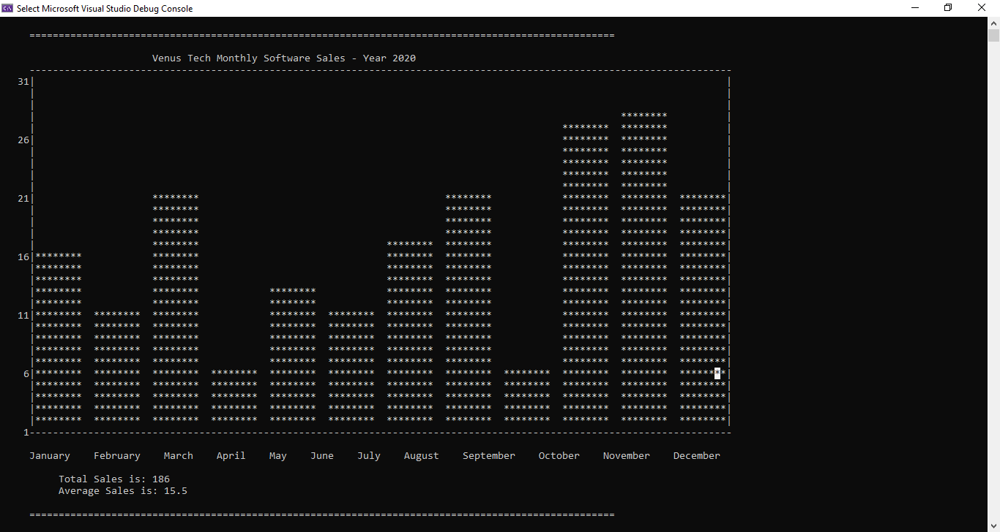
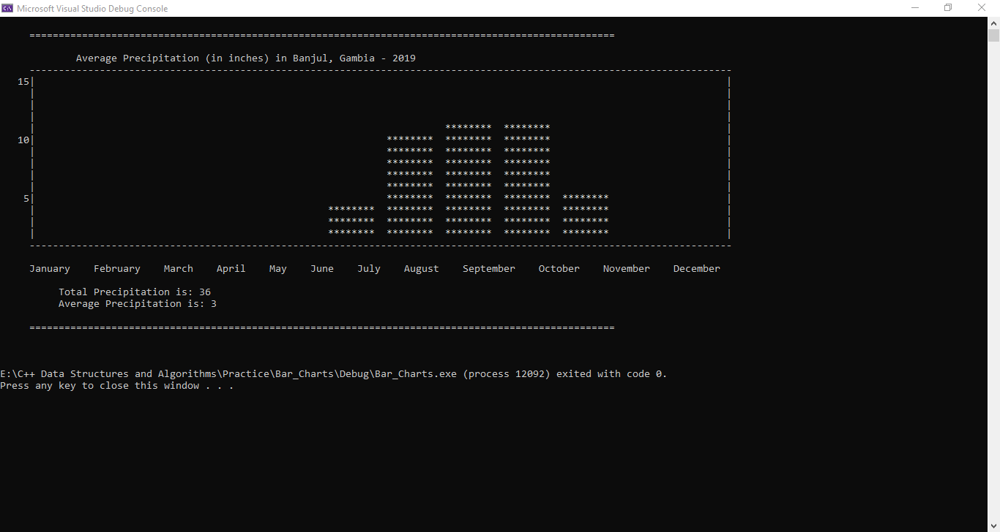

# Implementing Bar Chart Operations using Single Linked List

## Prerequisites 

The Project runs on Visual Studio with C++ installed. It is highly recommended to maximize the CLI 
to clearly see the chart especially for larger data sets. Use data sets with no more than 12 bars to plot 
for it to appear clearly and organized on the CLI. Sample data sets can be found here [`dataSet1.txt`](dataSet1.txt)
For data sets larger than 12 bars to plot, it is advisable to use Python[Spyder Editor] or other data visualization tools. 

## About 

A bar chart or bar graph is a chart or graph that presents 
categorical data with rectangular bars with heights or 
lengths proportional to the values that they represent

1. The Program reads a data set and extracts the necessary data 
2. The data read can be used to create a node which will contain the height of each bar and their label
3. The Program uses these info to populate the bar chart
4. The data is used to calculate the mean and total sum of the values given.
5. The program then displays these results on the CLI.
6. The program uses a single linked list data structure to solve this statistical problem

## Technologies 

The Program is fully implemented using the C & C++ Programming Languages and the Single Linked List data structure.

## Screenshots

### Test 1

### Test 2

